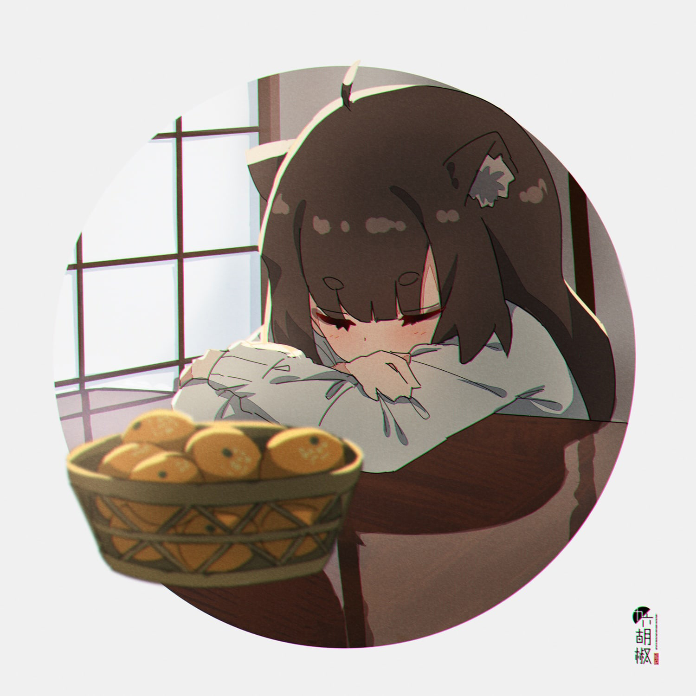

# ART-Community-Dev
идея: объединение творческих личностей

задумка: создание общины творческих людей, которые смогут помогать друг другу в процессе

# особенности:

## [ для участников проекта ]

– Возможность поделиться своим творчеством  
– Возможность завести новые знакомства  
– Возможность получить критику  
– Возможность получить советов от опытных   
– Возможность получить заказ    
_примечание 1:_ если участник покидает проект с активным заказом, ему придется его завершить, в противном случае он будет занесен в черный список проекта и лешен возможности вернуться в него    
_примечание 2:_ при оформлении заказа через объединение взимается %     
_примечание 3:_ участники, активно (и успешно) выполняющие заказы, получают очки репутации. чем выше репутация, тем более выгодные условия им предлагаются    

– Реф-программа
_примечание:_ творцы, приглашающие новых участников, временно (допустим на протяжении 6 месяцев) будут получать % (зависит от репутации каждого) с работ приглашенных   
– При уходе из проекта участнику собирается портфолио

## [ для клиентов ]

– Безопасная сделка     
примечание: оформляя заказ через объединение, проект следит за благополучием проведения сделки. в случае невыполнения договоренности одной из сторон (просрочка или невыполнение в принципе), проект обязуется вернуть предоплату в полной мере 
– Большое (ну, зависит от успешности проекта) кол-во творцов; возможность просмотреть портфолио творца

## [ социальная часть]

– Кофе-фонд     
_примечание 1:_ собирается из остатков (основная часть идет на поддержание техники в рабочем состоянии) прибыли с взимания %
_примечание 2:_ фонд может использоваться для организации ярмарок/аукционов/сходок/прочих мероприятий

## [ сотрудничество ]

– Возможность обсудить сотрудничество с данным проектом     
_пример:_ сотрудничество со школами искусств (художественных/музыкальных/театральных)/иными организациями

# Связь с автором

— VK: vk.com/idogidog
— TG: t.me/idogidog
